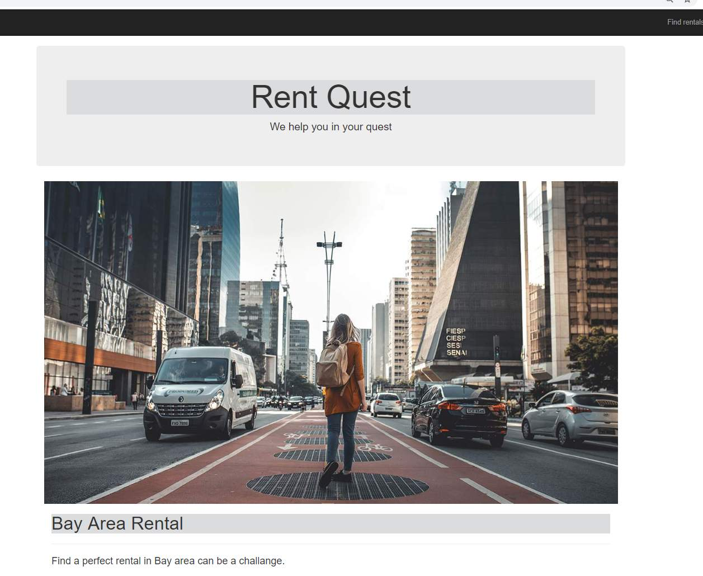
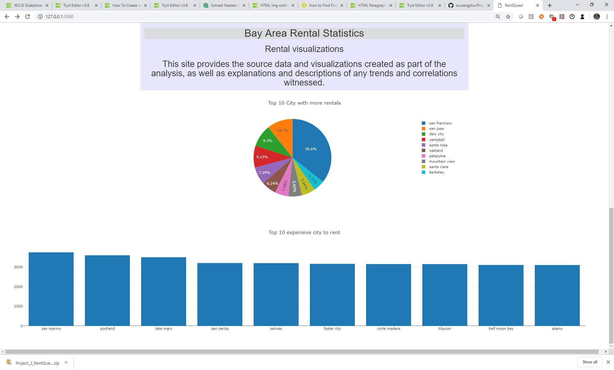
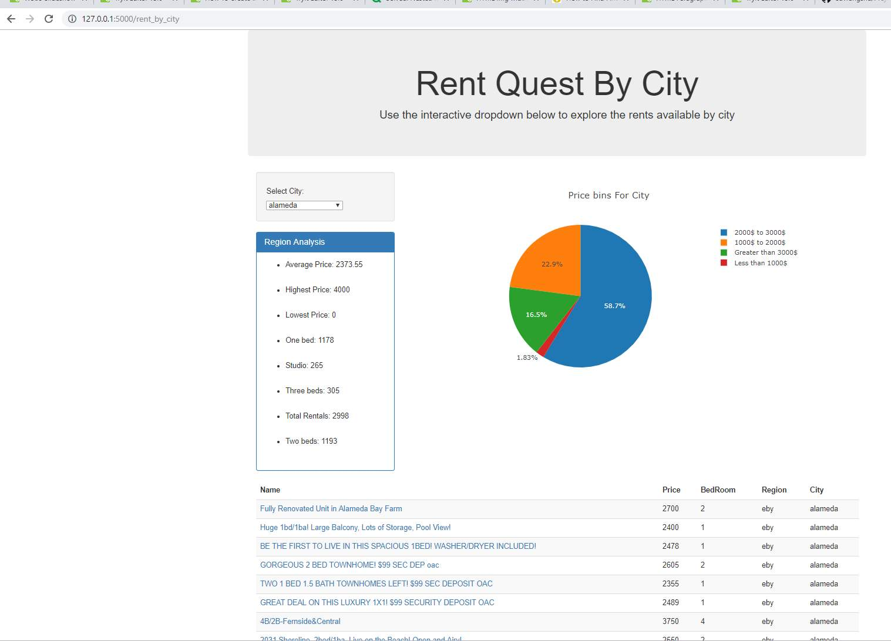
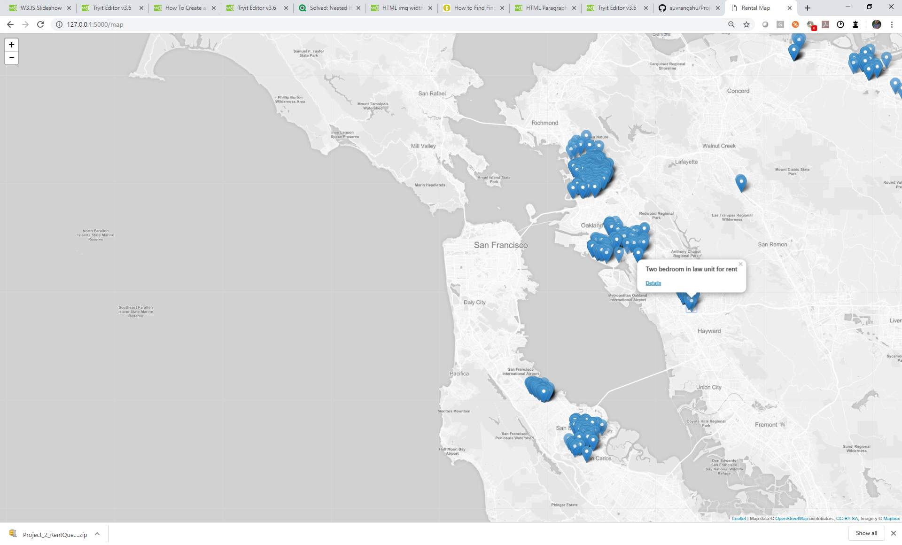
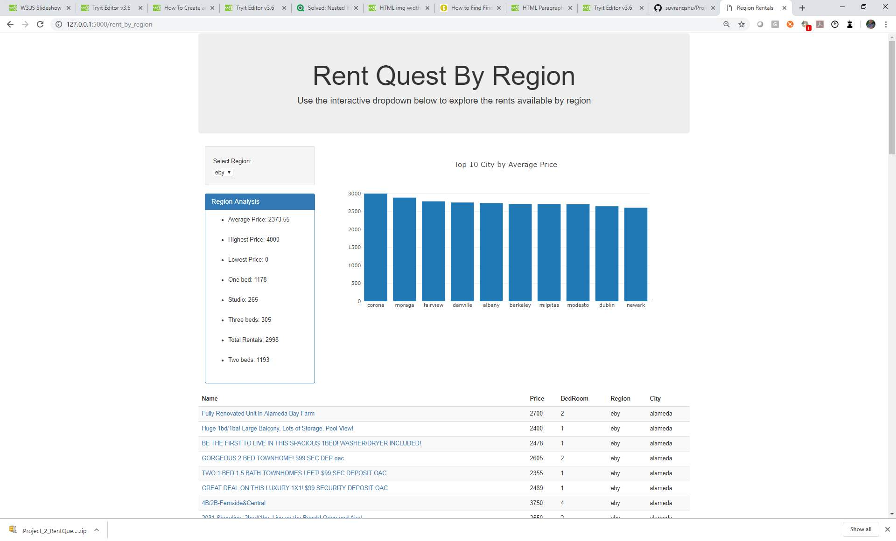

# Unit 19 - Project 2

# Rent Quest
## Your search ...our analysis..

## By Prem Ganesh, Amitava Samaddar, Jason Zeleya & Suvrangshu Ghosh

--------------------------------------------------

Finding a perfect Bay area rental

Where to look?

Which locations has best rentals?

Lowest rentals costs by region/ city?

We went to rental listing web sites (craigslist) and pulled all data across the bay area.

More than 14000 records.

Went through extensive data cleanup through python

Created structured data 

Identified locations using geo tags

Wrote the data into csv files.

Using Python pulled the data in Mongodb

Using Python, Java, flask, D3, Leafty, java library .

## How to execute the code?

Please go to folder mongodb_data

create mongodb **database** called - **craigslist_db**

import the **collection** named - **craigslist_collection**

- Open Git bash
- execute app.py
- Go to Google chrome
type http://127.0.0.1:5000/

it will open page :

Please navigate through various options to see our analysis 

## Used Java script library from w3schools, which helps to keep rendering the images in our landing page.

